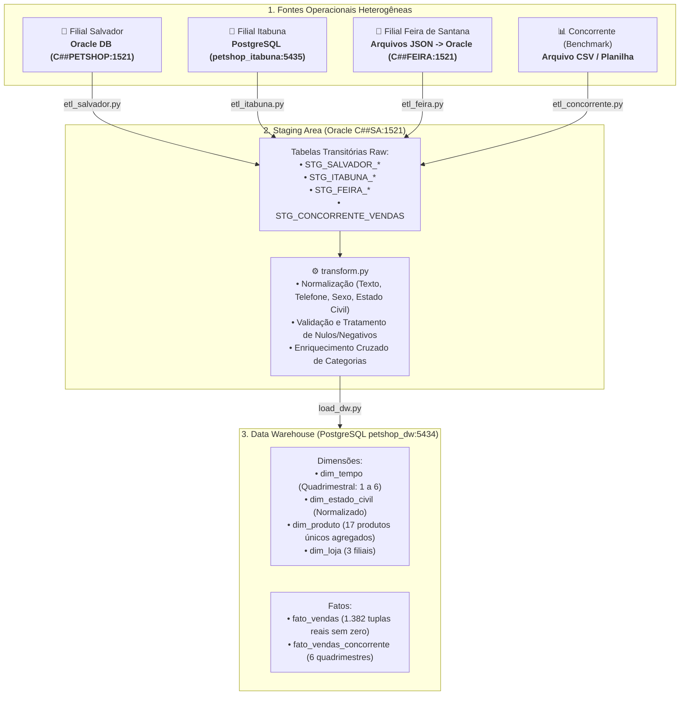

# 🐾 Petshop DW — Pipeline de Engenharia & Mineração de Dados (Unidade 1)

<div align="center">


</div>

---

## 📌 Sobre o Projeto

Este repositório contém a implementação completa da **Unidade 1** da disciplina de **Mineração de Dados / Engenharia de Dados**.

O objetivo do projeto é unificar, limpar, padronizar e modelar dados provenientes de múltiplos sistemas operacionais transacionais heterogêneos de uma rede de **Petshops** espalhada por diferentes filiais na Bahia, além de dados de benchmark do mercado (concorrente), culminando na construção de um **Data Warehouse (DW)** estruturado em modelo dimensional (*Star Schema*).

---

## 🏗️ Arquitetura da Solução



---

## 🏛️ Detalhamento das Camadas

### 1. Fontes de Dados (Origens)
* **Filial Salvador**: Sistema legado em **Oracle Database** (Schema `C##PETSHOP`).
* **Filial Itabuna**: Sistema em **PostgreSQL** (Porta `5435`, database `petshop_itabuna`).
* **Filial Feira de Santana**: Dados originários em arquivos JSON (`05_Feira_Clientes.json`, `06_Feira_Produtos.json`, `07_Feira_Pedidos.json`), carregados diretamente no banco Oracle (Schema `C##FEIRA`) via `json_para_DML.py` sem geração de `.sql` intermediário.
* **Concorrente**: Dados históricos de faturamento mensal originados de arquivo CSV (`08_Vendas_Concorrente.csv`), carregados diretamente na Staging Area via `etl_concorrente.py`.

### 2. Staging Area (`src/staging_area/`)
Centralizada no schema **`C##SA`** do Oracle Database, desacoplando a extração das regras analíticas:
* **`staging-area-DDL.sql`**: Define as estruturas transitórias isoladas por filial.
* **`etl_salvador.py`**: Extrai dados de `C##PETSHOP` e carrega nas tabelas `STG_SALVADOR_*`.
* **`etl_itabuna.py`**: Extrai dados do PostgreSQL de Itabuna e carrega nas tabelas `STG_ITABUNA_*`.
* **`etl_feira.py`**: Extrai dados de `C##FEIRA` e carrega nas tabelas `STG_FEIRA_*`.
* **`etl_concorrente.py`**: Extrai dados de vendas do concorrente para `STG_CONCORRENTE_VENDAS`.

### 3. Processamento e Higienização (`src/staging_area/transform.py`)
Garante a qualidade, integridade e enriquecimento dos dados:
* **Padronização Cadastral**:
  * Nomes e produtos convertidos para *Title Case* e sem espaços duplicados.
  * E-mails normalizados em minúsculas (*lowercase*).
  * Telefones padronizados com máscara nacional `(XX) XXXXX-XXXX` ou `(XX) XXXX-XXXX`.
  * Gênero padronizado (`M`, `F`, `Não Informado`).
  * Estado civil consolidado (*Solteiro(a)*, *Casado(a)*, *Divorciado(a)*, *Viúvo(a)*, *União Estável* e *Não Informado*).
* **Regras de Integridade**:
  * Quantidades e preços negativos ou nulos tratados e validados.
* **Enriquecimento Cruzado de Categorias**:
  * Identificação de produtos com categoria nula (`NULL`) e preenchimento automático consultando o catálogo unificado das filiais via similaridade fonética e normalização textual.

### 4. Data Warehouse (`src/dw/`)
Modelagem dimensional implementada em **PostgreSQL** (Porta `5434`, database `petshop_dw`):
* **`dim_tempo`**: Granularidade estritamente quadrimestral e anual baseada na chave substituta sequencial `sk_tempo` (1 a 6), contendo `ano` e `quadrimestre`.
* **`dim_estado_civil`**: Contém apenas os estados civis normalizados distintos, atendendo às regras de negócio e minimização de dados da LGPD.
* **`dim_produto`**: Catálogo único e agregado de produtos unificados entre todas as filiais com `id_origem`, nome e categoria (sem redundância de origem ou preços fixados).
* **`dim_loja`**: Dimensão com as unidades físicas e sistemas de origem.
* **`fato_vendas`**: Métricas de faturamento e volume vendidas agregadas por quadrimestre/ano, estado civil, produto e loja (**1.382 registros reais sem zero**).
* **`fato_vendas_concorrente`**: Faturamento do concorrente agregado por quadrimestre/ano para comparativo direto de *market share*.

---

## 📂 Estrutura do Diretório

```plaintext
mineracao_de_dados/
│
├── .env.example                     # Modelo de variáveis de ambiente (sem credenciais)
├── .env                             # Arquivo de configuração ativo (ignorado no git)
├── docker-compose.yaml              # Orquestração dos bancos de dados locais
├── pyproject.toml                   # Gerenciamento de projeto e dependências (UV / Python)
├── uv.lock                          # Lockfile determinístico de dependências do UV
├── README.md                        # Documentação de execução local sem N8N
├── n8n.md                           # Guia completo de automação via N8N
│
└── src/
    ├── config.py                    # Leitura centralizada de variáveis do .env
    ├── concorrente/
    │   ├── 08_Vendas_Concorrente.csv# Arquivo CSV fonte do concorrente
    │   ├── etl_concorrente.py       # Carga direta do CSV na Staging Area (C##SA)
    │   └── concorrente-DML.sql      # Script DML legado
    │
    ├── filial_feira/
    │   ├── 05_Feira_Clientes.json   # Fonte JSON: Clientes
    │   ├── 06_Feira_Produtos.json   # Fonte JSON: Produtos
    │   ├── 07_Feira_Pedidos.json    # Fonte JSON: Pedidos e Itens
    │   ├── feira-DDL.sql            # Estrutura do schema C##FEIRA
    │   ├── json_para_DML.py         # Carga direta dos JSONs no banco C##FEIRA
    │   └── carregar_feira.py        # Alias de execução direta
    │
    ├── staging_area/
    │   ├── staging-area-DDL.sql     # DDL de todas as tabelas intermediárias (Staging Area)
    │   ├── etl_salvador.py          # Pipeline de extração: Salvador -> Staging
    │   ├── etl_itabuna.py           # Pipeline de extração: Itabuna -> Staging
    │   ├── etl_feira.py             # Pipeline de extração: Feira -> Staging
    │   ├── etl_concorrente.py       # Runner de extração do Concorrente -> Staging
    │   └── transform.py             # Script de padronização, limpeza e enriquecimento
    │
    └── dw/
        ├── dw-DDL.sql               # Esquema dimensional (Star Schema) do Data Warehouse
        └── load_dw.py               # Script de carga final no DW PostgreSQL
```

---

## 🚀 Como Executar o Projeto SEM N8N (Manual / CLI)

Siga o passo a passo abaixo para rodar o pipeline completo localmente utilizando o terminal.

### 1. Pré-requisitos
* [Docker Desktop](https://www.docker.com/) instalado e em execução.
* [Python 3.12+](https://www.python.org/) ou [Astral UV](https://docs.astral.sh/uv/) instalado.
* Client SQL de sua preferência (DBeaver, VS Code Database Client, pgAdmin, SQL Developer).

### 2. Subir os Bancos de Dados
Na raiz do projeto, suba todos os containers de banco:
```bash
docker compose up -d
```

Serviços disponibilizados no Docker:
| Serviço | Tecnologia | Porta Host | Usuário | Senha | Database / Service |
|---|---|---|---|---|---|
| `oracle-db` | Oracle 21c XE | `1521` | `system` / `C##SA` | `cimatec` | `XE` |
| `postgres-itabuna` | PostgreSQL 16 | `5435` | `postgres` | `cimatec` | `petshop_itabuna` |
| `postgres-dw` | PostgreSQL 16 | `5434` | `postgres` | `cimatec` | `petshop_dw` |
| `mongo-feira` | MongoDB 7.0 | `27017` | `admin` | `cimatec` | `petshop_feira` |

### 3. Configurar as Variáveis de Ambiente (`.env`)
Copie o arquivo de exemplo para criar o seu `.env`:
```bash
cp .env.example .env
```
*(No Windows PowerShell: `Copy-Item .env.example .env`)*

Verifique se os valores do arquivo `.env` correspondem às portas e senhas do seu ambiente.

### 4. Configurar o Ambiente Python
Utilizando o gerenciador **UV** (recomendado):
```bash
# Sincronizar e criar ambiente virtual automaticamente
uv sync
```

Ou utilizando o `venv` tradicional com `pip`:
```bash
python -m venv .venv

# Ativar no Windows PowerShell:
.\.venv\Scripts\Activate.ps1

# Ativar no Linux/macOS:
source .venv/bin/activate

# Instalar dependências:
pip install oracledb psycopg2
```

---

### 5. Execução Sequencial do Pipeline ETL

Execute os comandos abaixo a partir da raiz do repositório:

#### Passo 5.1: Carga dos Dados de Feira no Banco de Origem (`C##FEIRA`)
Carrega os arquivos JSON diretamente nas tabelas da filial Feira de Santana:
```bash
python src/filial_feira/json_para_DML.py --dir src/filial_feira
```

#### Passo 5.2: Carga das Vendas do Concorrente na Staging Area
Lê o arquivo CSV de vendas e insere diretamente em `STG_CONCORRENTE_VENDAS`:
```bash
python src/concorrente/etl_concorrente.py --file src/concorrente/08_Vendas_Concorrente.csv
```

#### Passo 5.3: Extração das Filiais para a Staging Area (`C##SA`)
Extrai os dados operacionais das 3 filiais para as tabelas transitórias do Oracle Staging:
```bash
python src/staging_area/etl_salvador.py
python src/staging_area/etl_itabuna.py
python src/staging_area/etl_feira.py
```

#### Passo 5.4: Higienização, Padronização e Enriquecimento
Executa a limpeza das tabelas `STG_*`, tratando dados nulos, estados civis, categorias e telefones:
```bash
python src/staging_area/transform.py
```

#### Passo 5.5: Carga Final no Data Warehouse (`petshop_dw`)
Cria os mapas de dimensões e popula as tabelas `dim_*` e `fato_*`:
```bash
python src/dw/load_dw.py
```

---

### 6. Verificação dos Resultados no Data Warehouse

Ao término da execução do `load_dw.py`, você verá o resumo das tabelas carregadas no PostgreSQL (`petshop_dw`):
* `dim_tempo`: **6 registros** (granularidade quadrimestral 2024 e 2025)
* `dim_loja`: **3 registros** (Salvador, Itabuna e Feira de Santana)
* `dim_estado_civil`: **6 registros** (`Casado(a)`, `Divorciado(a)`, `Não Informado`, `Solteiro(a)`, `União Estável`, `Viúvo(a)`)
* `dim_produto`: **17 registros** (catálogo unificado)
* `fato_vendas`: **1.382 tuplas reais sem zero**
* `fato_vendas_concorrente`: **6 registros quadrimestrais**

---

## 🤖 Automação com N8N

Para orquestrar e agendar este pipeline automaticamente utilizando o **N8N** (com gatilhos automáticos, passagem dinâmica de arquivos e alertas de erro), consulte o guia dedicado:

👉 **[Consulte o Guia de Automação no n8n.md](file:///c:/Users/yanchagas04/Documents/dev/mineracao_de_dados/n8n.md)**

---

## 👥 Autores

<table>
  <tr>
    <td align="center">
      <a href="https://github.com/yanchagas04">
        <br>
        <sub><b>Yan Chagas</b></sub>
      </a>
    </td>
    <td align="center">
      <a href="https://github.com/DSantana04">
        <br>
        <sub><b>Danilo Santana</b></sub>
      </a>
    </td>
    <td align="center">
      <a href="https://github.com/diegoperpetuo">
        <br>
        <sub><b>Diego Perpétuo</b></sub>
      </a>
    </td>
    <td align="center">
      <a href="https://github.com/vfdeoliveira1">
        <br>
        <sub><b>Vinícius Oliveira</b></sub>
      </a>
    </td>
    <td align="center">
      <a href="https://github.com/vhjsoficial1">
        <br>
        <sub><b>Vitor Hugo</b></sub>
      </a>
    </td>
  </tr>
</table>

Projeto desenvolvido para a disciplina de **Mineração de Dados**.
