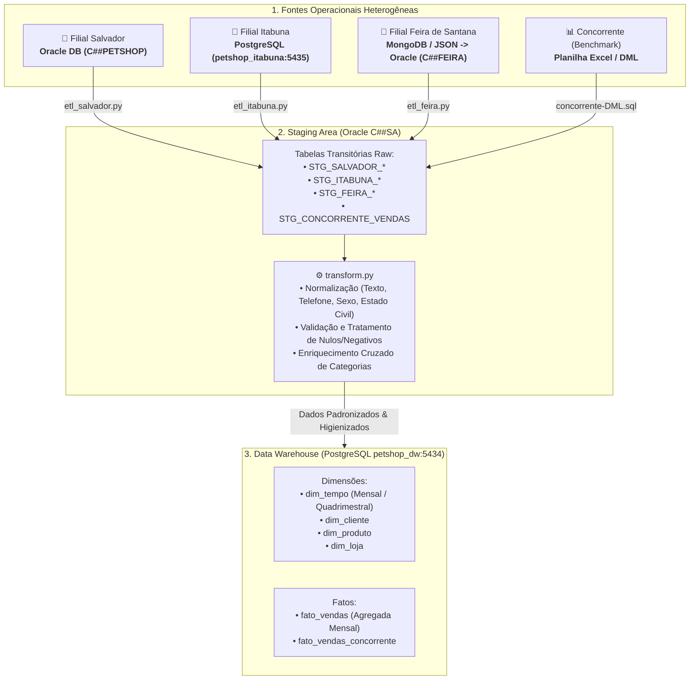

# 🐾 Petshop DW — Pipeline de Engenharia & Mineração de Dados (Unidade 1)

<div align="center">


</div>

---

## 📌 Sobre o Projeto

Este repositório contém a implementação completa da **Unidade 1** da disciplina de **Mineração de Dados / Engenharia de Dados**.

O objetivo do projeto é unificar, limpar, padronizar e modelar dados provenientes de múltiplos sistemas operacionais transacionais heterogêneos de uma rede de **Petshops** espalhada por diferentes filiais na Bahia, além de dados de benchmark do mercado (concorrente), culminando na construção de um **Data Warehouse (DW)** estruturado em modelo dimensional (*Star Schema*).

---

## 🏗️ Arquitetura da Solução



---

## 🏛️ Detalhamento das Camadas

### 1. Fontes de Dados (Origens)
* **Filial Salvador**: Sistema legado em **Oracle Database** (Schema `C##PETSHOP`).
* **Filial Itabuna**: Sistema em **PostgreSQL** (Porta `5435`, database `petshop_itabuna`).
* **Filial Feira de Santana**: Dados exportados de **MongoDB/JSON**, convertidos em scripts SQL (`json_para_DML.py` & `feira-DML.sql`) e carregados em Oracle (Schema `C##FEIRA`).
* **Concorrente**: Dados históricos de faturamento mensal originados de planilha de mercado para benchmark competitivo.

### 2. Staging Area (`staging_area/`)
A Staging Area está centralizada no usuário **`C##SA`** do Oracle Database. Ela atua como repositório intermediário desacoplado dos bancos de produção:
* **`staging-area-DDL.sql`**: Define as estruturas transitórias isoladas por filial.
* **`etl_salvador.py`**: Extrai dados de `C##PETSHOP` e carrega nas tabelas `STG_SALVADOR_*`.
* **`etl_itabuna.py`**: Extrai dados do PostgreSQL de Itabuna e carrega nas tabelas `STG_ITABUNA_*`.
* **`etl_feira.py`**: Extrai dados de `C##FEIRA` e carrega nas tabelas `STG_FEIRA_*`.

### 3. Processamento e Higienização (`transform.py`)
Script responsável pela qualidade dos dados antes do envio ao Data Warehouse:
* **Padronização Cadastral**:
  * Nomes e produtos convertidos para *Title Case* e sem espaços duplicados.
  * E-mails normalizados em *lowercase*.
  * Telefones padronizados com máscara nacional `(XX) XXXXX-XXXX` ou `(XX) XXXX-XXXX`.
  * Gênero padronizado para sigla binária (`M`, `F`, `Não Informado`).
  * Estado civil consolidado (*Solteiro(a)*, *Casado(a)*, etc.).
* **Regras de Integridade**:
  * Quantidades e preços negativos ou nulos corrigidos.
* **Enriquecimento Cruzado de Categorias**:
  * Identificação de produtos de Salvador com categoria nula (`NULL`) e preenchimento automático consultando o catálogo unificado das filiais de Itabuna e Feira via similaridade fonética/normalização textual.

### 4. Data Warehouse (`dw/`)
Modelagem dimensional implementada em **PostgreSQL** (Porta `5434`, database `petshop_dw`):
* **`dim_tempo`**: Granularidade mensal baseada na chave substituta `sk_tempo` (`YYYYMM`), contendo atributos analíticos como ano, mês, nome do mês, ano-mês e quadrimestre.
* **`dim_cliente`**: Cadastro unificado de clientes das filiais com surrogate key e controle da origem de extração (`origem_fonte`).
* **`dim_produto`**: Catálogo unificado de produtos com preços de referência.
* **`dim_loja`**: Dimensão com as unidades físicas e sistemas de origem.
* **`fato_vendas`**: Métricas de faturamento e volume vendidas agregadas mensalmente por cliente, produto e loja.
* **`fato_vendas_concorrente`**: Série temporal do faturamento do concorrente para análises de *market share*.

---

## 📂 Estrutura do Diretório

```plaintext
mineracao_de_dados/
│
├── concorrente/
│   └── concorrente-DML.sql      # Inserção das métricas históricas do concorrente
│
├── dw/
│   └── dw-DDL.sql               # Esquema dimensional (Star Schema) do Data Warehouse
│
├── filial_feira/
│   ├── feira-DDL.sql            # DDL da filial Feira de Santana
│   ├── feira-DML.sql            # Carga gerada a partir dos JSONs originais
│   └── json_para_DML.py         # Conversor de JSON para comandos SQL INSERT Oracle
│
├── staging_area/
│   ├── staging-area-DDL.sql     # DDL de todas as tabelas intermediárias (Staging Area)
│   ├── etl_salvador.py          # Pipeline de extração: Salvador -> Staging
│   ├── etl_itabuna.py           # Pipeline de extração: Itabuna -> Staging
│   ├── etl_feira.py             # Pipeline de extração: Feira -> Staging
│   └── transform.py             # Script de padronização, limpeza e enriquecimento
│
├── docker-compose.yaml          # Orquestração dos bancos de dados locais
├── .gitignore                   # Arquivos ignorados no versionamento
└── README.md                    # Documentação do projeto
```

---

## 🚀 Como Executar o Ambiente

### 1. Pré-requisitos
* [Docker Desktop](https://www.docker.com/) instalado e em execução.
* [Python 3.10+](https://www.python.org/) instalado.
* Client SQL de sua preferência (DBeaver, VS Code Database Client, pgAdmin, SQL Developer).

### 2. Subir os Bancos de Dados
No terminal, execute:
```bash
docker compose up -d
```

Serviços disponibilizados:
| Serviço | Tecnologia | Porta Host | Usuário | Senha | Database / Service |
|---|---|---|---|---|---|
| `oracle-db` | Oracle 21c XE | `1521` | `system` / `C##SA` | `cimatec` | `XE` |
| `postgres-itabuna` | PostgreSQL 16 | `5435` | `postgres` | `cimatec` | `petshop_itabuna` |
| `postgres-dw` | PostgreSQL 16 | `5434` | `postgres` | `cimatec` | `petshop_dw` |
| `mongo-feira` | MongoDB 7.0 | `27017` | `admin` | `cimatec` | `petshop_feira` |

### 3. Configurar o Ambiente Python
Recomenda-se criar um ambiente virtual:
```bash
python -m venv .venv
# No Windows PowerShell:
.\.venv\Scripts\Activate.ps1

# Instalar dependências necessárias:
pip install oracledb psycopg2
```

### 4. Executar os Pipelines de Carga para Staging
Navegue até o diretório `staging_area/`:
```bash
cd staging_area

# Carga de cada filial para a Staging Area
python etl_salvador.py
python etl_itabuna.py
python etl_feira.py
```

### 5. Executar a Higienização e Enriquecimento dos Dados
```bash
python transform.py
```

---

## 👥 Autores

<table>
  <tr>
    <td align="center">
      <a href="https://github.com/yanchagas04">
        <br>
        <sub><b>Yan Chagas</b></sub>
      </a>
    </td>
    <td align="center">
      <a href="https://github.com/DSantana04">
        <br>
        <sub><b>Danilo Santana</b></sub>
      </a>
    </td>
    <td align="center">
      <a href="https://github.com/diegoperpetuo">
        <br>
        <sub><b>Diego Perpétuo</b></sub>
      </a>
    </td>
    <td align="center">
      <a href="https://github.com/vfdeoliveira1">
        <br>
        <sub><b>Vinícius Oliveira</b></sub>
      </a>
    </td>
    <td align="center">
      <a href="https://github.com/vhjsoficial1">
        <br>
        <sub><b>Vitor Hugo</b></sub>
      </a>
    </td>
  </tr>
</table>

Projeto desenvolvido para a disciplina de **Mineração de Dados**.

