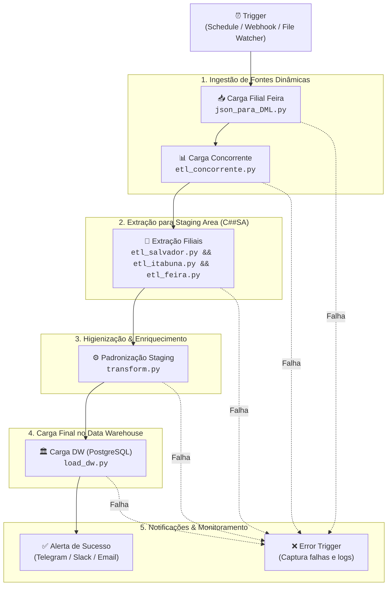

# 🔄 Guia de Automação e Orquestração com N8N

Este documento descreve como configurar, automatizar e orquestrar o pipeline completo de Engenharia de Dados e Data Warehouse (**Petshop DW**) utilizando o **N8N**.

---

## 📌 Visão Geral da Automação

No N8N, cada etapa do pipeline é executada de forma desacoplada através de nós do tipo **Execute Command** (ou via nós **SSH** / **Docker** caso o N8N esteja em um servidor separado).

Os scripts foram desenvolvidos com os seguintes princípios essenciais para automação contínua:
1. **Sem `.sql` intermediário**: Todas as operações DDL/DML, transações e commits são realizadas diretamente nos bancos de dados via Python.
2. **Idempotência**: Cada etapa limpa os dados antes da carga, garantindo que reexecuções parciais ou totais nunca gerem duplicatas.
3. **Códigos de Saída Padrão (Exit Codes)**:
   * Retorno `0` em caso de sucesso (o N8N prossegue para o próximo nó).
   * Retorno `1` em caso de falha/exceção (o N8N interrompe o fluxo e aciona o tratamento de erro).
4. **Configuração Desacoplada (`.env`)**: Credenciais e portas são injetadas por variáveis de ambiente.

---

## 🏗️ Arquitetura do Workflow no N8N



---

## ⚙️ Pré-requisitos de Configuração do N8N

### 1. Acesso ao Projeto
O N8N precisa ter acesso ao diretório do projeto e ao interpretador Python com as bibliotecas instaladas (`oracledb`, `psycopg2`).
* Se estiver usando o **N8N local / Desktop / Docker**, monte o diretório do projeto como volume no container do N8N:
  ```yaml
  volumes:
    - /caminho/do/projeto/mineracao_de_dados:/data/mineracao_de_dados
  ```
* Se o N8N estiver em uma máquina separada, utilize o nó **SSH (Execute Command)** apontando para o servidor do pipeline.

### 2. Variáveis de Ambiente
Certifique-se de que o arquivo `.env` esteja presente na raiz do projeto ou configure as variáveis diretamente no painel do N8N (*Settings > Environment Variables*).

---

## 🛠️ Configuração Nó por Nó no N8N

### Nó 1: Gatilho (Trigger)
* **Tipo de Nó**: `Schedule Trigger` (Agendador) ou `Webhook`
* **Configuração recomendada**:
  * **Cron Expression**: `0 2 * * *` (Executar diariamente às 02:00 da manhã) ou disparo sob demanda via Webhook.

---

### Nó 2: Ingestão de Feira de Santana
* **Tipo de Nó**: `Execute Command`
* **Nome**: `Carga Filial Feira (Oracle C##FEIRA)`
* **Comando**:
  ```bash
  cd /caminho/do/projeto && python src/filial_feira/json_para_DML.py --dir src/filial_feira
  ```
* **Caso o N8N receba os JSONs via webhook/download dinâmico**:
  ```bash
  python src/filial_feira/json_para_DML.py \
    --clientes "{{ $node['Download'].json.clientesPath }}" \
    --produtos "{{ $node['Download'].json.produtosPath }}" \
    --pedidos  "{{ $node['Download'].json.pedidosPath }}"
  ```

---

### Nó 3: Ingestão de Dados do Concorrente
* **Tipo de Nó**: `Execute Command`
* **Nome**: `Carga Concorrente (Staging C##SA)`
* **Comando**:
  ```bash
  cd /caminho/do/projeto && python src/concorrente/etl_concorrente.py --file src/concorrente/08_Vendas_Concorrente.csv
  ```
* **Caso o N8N receba uma nova planilha/CSV por e-mail ou webhook**:
  ```bash
  python src/concorrente/etl_concorrente.py --file "{{ $binary.data.path }}"
  ```

---

### Nó 4: Extração das Filiais para a Staging Area
* **Tipo de Nó**: `Execute Command`
* **Nome**: `Extrair Filiais para Staging (C##SA)`
* **Comando**:
  ```bash
  cd /caminho/do/projeto && python src/staging_area/etl_salvador.py && python src/staging_area/etl_itabuna.py && python src/staging_area/etl_feira.py
  ```

---

### Nó 5: Higienização, Padronização e Enriquecimento
* **Tipo de Nó**: `Execute Command`
* **Nome**: `Transformação e Padronização Staging`
* **Comando**:
  ```bash
  cd /caminho/do/projeto && python src/staging_area/transform.py
  ```

---

### Nó 6: Carga no Data Warehouse
* **Tipo de Nó**: `Execute Command`
* **Nome**: `Carga Final DW (PostgreSQL)`
* **Comando**:
  ```bash
  cd /caminho/do/projeto && python src/dw/load_dw.py
  ```

---

### Nó 7: Notificação de Sucesso
* **Tipo de Nó**: `Telegram`, `Discord`, `Slack` ou `Send Email`
* **Mensagem de Exemplo**:
  ```text
  ✅ Pipeline Petshop DW executado com sucesso!
  • Dimensões atualizadas: dim_tempo, dim_loja, dim_estado_civil, dim_produto
  • Fato Vendas: 1.382 registros processados
  • Fato Concorrente: 6 quadrimestres atualizados
  • Data de execução: {{ $now.format('DD/MM/YYYY HH:mm:ss') }}
  ```

---

### Nó 8: Gestão de Erros (Error Trigger)
* **Tipo de Nó**: `Error Trigger`
* Conecte a um nó de notificação para alertar a equipe caso qualquer um dos scripts retorne erro:
  ```text
  ⚠️ ALERTA: Falha na execução do Pipeline Petshop DW!
  • Nó com erro: {{ $json.execution.error.node.name }}
  • Detalhes do erro: {{ $json.execution.error.message }}
  • Timestamp: {{ $now }}
  ```

---

## 📋 Template JSON para Importação Direta no N8N

Para criar o fluxo no seu N8N instantaneamente:
1. Abra o N8N no navegador.
2. Crie um novo Workflow em branco.
3. Copie o JSON abaixo e pressione **Ctrl + V** dentro da tela do N8N:

```json
{
  "name": "Pipeline Petshop DW - ETL Completo",
  "nodes": [
    {
      "parameters": {
        "rule": {
          "interval": [
            {
              "field": "days",
              "triggerAtHour": 2
            }
          ]
        }
      },
      "name": "Schedule Trigger (02:00)",
      "type": "n8n-nodes-base.scheduleTrigger",
      "typeVersion": 1.1,
      "position": [200, 300]
    },
    {
      "parameters": {
        "command": "python src/filial_feira/json_para_DML.py --dir src/filial_feira"
      },
      "name": "1. Ingestao Feira",
      "type": "n8n-nodes-base.executeCommand",
      "typeVersion": 1,
      "position": [420, 300]
    },
    {
      "parameters": {
        "command": "python src/concorrente/etl_concorrente.py --file src/concorrente/08_Vendas_Concorrente.csv"
      },
      "name": "2. Ingestao Concorrente",
      "type": "n8n-nodes-base.executeCommand",
      "typeVersion": 1,
      "position": [640, 300]
    },
    {
      "parameters": {
        "command": "python src/staging_area/etl_salvador.py && python src/staging_area/etl_itabuna.py && python src/staging_area/etl_feira.py"
      },
      "name": "3. Extracao Staging",
      "type": "n8n-nodes-base.executeCommand",
      "typeVersion": 1,
      "position": [860, 300]
    },
    {
      "parameters": {
        "command": "python src/staging_area/transform.py"
      },
      "name": "4. Transformacao Staging",
      "type": "n8n-nodes-base.executeCommand",
      "typeVersion": 1,
      "position": [1080, 300]
    },
    {
      "parameters": {
        "command": "python src/dw/load_dw.py"
      },
      "name": "5. Carga DW",
      "type": "n8n-nodes-base.executeCommand",
      "typeVersion": 1,
      "position": [1300, 300]
    }
  ],
  "connections": {
    "Schedule Trigger (02:00)": {
      "main": [
        [
          {
            "node": "1. Ingestao Feira",
            "type": "main",
            "index": 0
          }
        ]
      ]
    },
    "1. Ingestao Feira": {
      "main": [
        [
          {
            "node": "2. Ingestao Concorrente",
            "type": "main",
            "index": 0
          }
        ]
      ]
    },
    "2. Ingestao Concorrente": {
      "main": [
        [
          {
            "node": "3. Extracao Staging",
            "type": "main",
            "index": 0
          }
        ]
      ]
    },
    "3. Extracao Staging": {
      "main": [
        [
          {
            "node": "4. Transformacao Staging",
            "type": "main",
            "index": 0
          }
        ]
      ]
    },
    "4. Transformacao Staging": {
      "main": [
        [
          {
            "node": "5. Carga DW",
            "type": "main",
            "index": 0
          }
        ]
      ]
    }
  }
}
```

---

## 🔍 Dicas de Monitoramento e Boas Práticas

1. **Ative o Retry on Fail**: Nos nós de banco ou rede, configure `Retry on Fail = 2` com intervalo de 30 segundos no N8N para cobrir eventuais instabilidades temporárias.
2. **Execute em Ambiente Isolado**: Configure o `Execute Command` para rodar dentro do ambiente virtual UV/venv (`.\.venv\Scripts\python.exe` no Windows ou `.venv/bin/python` no Linux).
3. **Capture os Outputs**: O N8N armazena o `stdout` retornado pelos scripts, permitindo auditar nos logs do próprio N8N exatamente quantos registros foram processados em cada execução.
